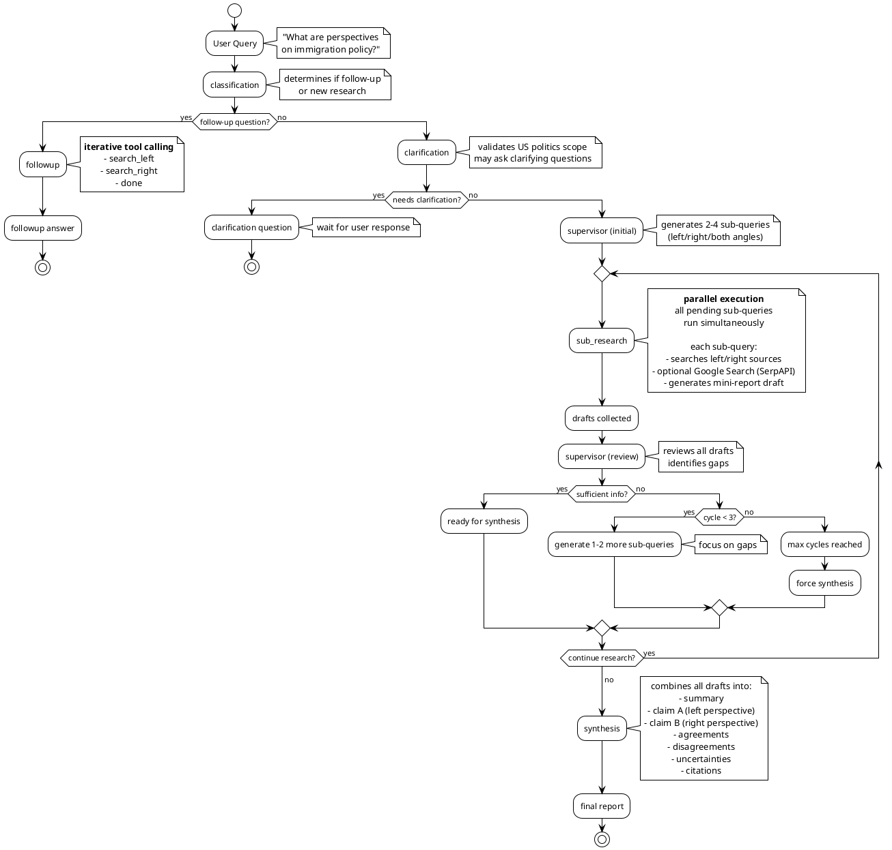

# Agents Module

LangGraph multi-agent workflow for balanced political research using a supervisor pattern with iterative deep research cycles.

## Architecture Overview

The agent system uses a **supervisor-driven research loop** where:

1. A supervisor generates sub-queries targeting left/right/both perspectives
2. All sub-queries execute in parallel per cycle
3. Supervisor reviews drafts and decides: continue research or synthesize
4. Max 3 cycles to prevent expensive runs (for now)
5. Final synthesis combines all drafts into balanced report

## Graph Flow



## State Management

The graph uses `AgentState` (TypedDict):

```python
class AgentState(TypedDict):
    # input
    query: str                          # user's question
    thread_id: str                      # conversation identifier
    clarification_response: str | None  # user's clarification (if needed)
    message_type: str                   # "research_prompt" or "follow_up_question"

    # clarification
    needs_clarification: bool           # whether query needs clarification
    clarification_questions: list[str]  # questions for user
    refined_query: str | None           # clarified query

    # supervisor cycle
    supervisor_cycle: int               # current cycle (1-3)
    sub_queries: list[SubQuery]         # all generated sub-queries
    pending_sub_queries: list[SubQuery] # sub-queries to execute this cycle
    drafts: list[Draft]                 # mini-reports from sub-research (accumulated)
    ready_for_synthesis: bool           # supervisor decision

    # output
    report: dict | None                 # final balanced report
    followup_answer: str | None         # answer to follow-up question
    citations: list[dict]               # all sources cited

    # streaming
    messages: list[dict]                # conversation history (LangGraph checkpointer)
    progress_updates: list[dict]        # SSE events emitted
```

## Nodes

### 1. Classification (`nodes/classification.py`)

Routes to appropriate workflow based on conversation history. Follow-up questions go to followup node, new research goes to clarification.

### 2. Clarification (`nodes/clarification.py`)

Validates query scope and clarity. If vague/ambiguous, generates clarifying questions and waits for user response. Otherwise, proceeds to supervisor with refined query.

### 3. Supervisor (`nodes/supervisor.py`)

Orchestrates research cycles (max 3):

- **Initial**: generates 2-4 sub-queries with angles (left/right/both)
- **Review**: evaluates drafts, identifies gaps, decides to continue or synthesize
- **Routing**: pending sub-queries → sub_research, ready → synthesis

Emits `sub_queries` and `supervisor_decision` events.

### 4. Sub-research (`nodes/sub_research.py`)

Executes all pending sub-queries in parallel using `asyncio.gather`:

1. Searches left/right/both sources based on angle
2. Optional SerpAPI for statistics (if `SERPAPI_KEY` set)
3. Generates mini-report draft with LLM
4. Extracts citations

Graceful degradation: if one sub-query fails, others continue. Emits `progress` and `draft` events.

### 5. Synthesis (`nodes/synthesis.py`)

Combines all drafts into final balanced report with:

- Summary, left/right perspectives with evidence
- Agreements, disagreements, uncertainties
- Validated citations (80% threshold)

### 6. Follow-up (`nodes/followup.py`)

Answers follow-up questions using iterative tool calling (max 10 calls):

- **Tools**: `search_left`, `search_right`, `done`
- **Context**: previous report + last 10 messages
- LLM decides which tool to use, searches as needed, provides final answer with citations

## Key Features

### Data Sources (`data_sources/registry.py`)

Registry pattern with async `DataSource` base class:

- **Left**: Guardian API, NYT API
- **Right**: NY Post RSS, Breitbart RSS, Daily Wire RSS, NewsAPI
- **Web**: SerpAPI (optional Google Search)

Methods: `search_left()`, `search_right()`, `search_all()`

### LLM Integration (`agents/llm.py`)

OpenRouter (Grok 4.1 Fast) with structured output via Pydantic, streaming, and token tracking. Configurable model/temperature via `settings`.

### Conversation Memory (`db/checkpointer.py`)

LangGraph PostgresSaver automatically persists conversation history in Postgres (`checkpoints`, `checkpoint_writes` tables). Thread-based isolation, no manual state management.

```python
checkpointer = await get_checkpointer()
graph = build_research_graph(checkpointer)
config = {"configurable": {"thread_id": thread_id}}
result = await graph.ainvoke(state, config)
```

### SSE Events (`api/routes/research.py`)

Server-sent events for real-time updates:

| Event                 | Description                      |
| --------------------- | -------------------------------- |
| `thread`              | Research started                 |
| `progress`            | Agent status update              |
| `clarification`       | Needs user input                 |
| `sub_queries`         | Supervisor generated sub-queries |
| `draft`               | Sub-research completed           |
| `supervisor_decision` | Continue or synthesize           |
| `report`              | Final report                     |
| `followup_answer`     | Follow-up answered               |
| `error` / `done`      | Stream status                    |
