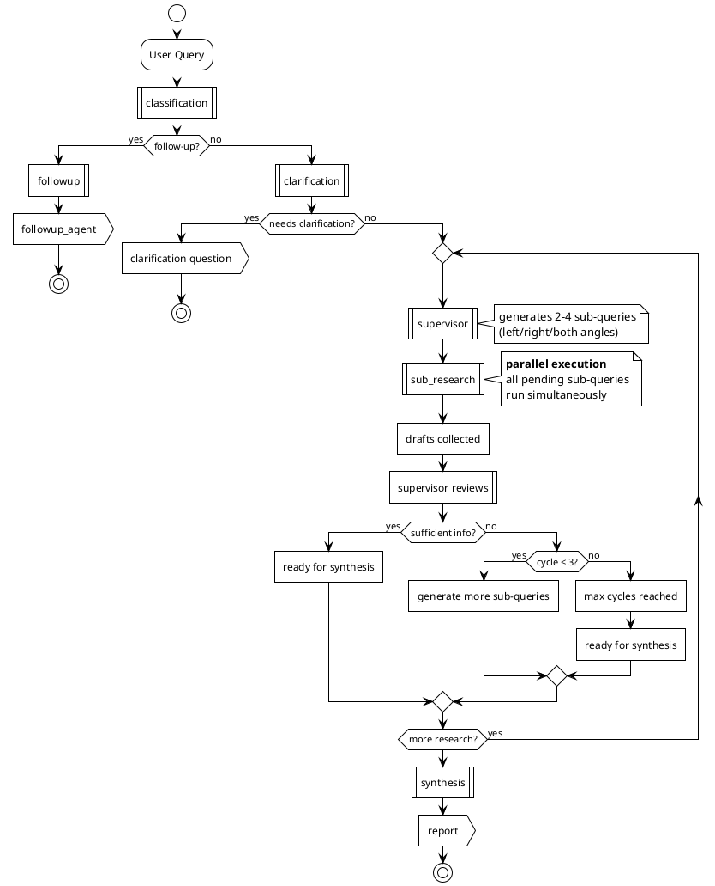

# Agents Module

LangGraph workflow for balanced political research using a supervisor pattern.

## Flow



The supervisor generates sub-queries (left/right/both angles), sub_research executes all pending queries in parallel per cycle, reviews drafts, and either requests more research or proceeds to synthesis. Max 3 cycles.

## Nodes

| Node             | Description                                            |
| ---------------- | ------------------------------------------------------ |
| `classification` | Routes to clarification (new query) or followup        |
| `clarification`  | Refines query, may request user clarification          |
| `supervisor`     | Generates sub-queries, reviews drafts, decides flow    |
| `sub_research`   | Executes all pending sub-queries in parallel per cycle |
| `synthesis`      | Combines drafts into final balanced report             |
| `followup`       | Answers follow-up questions with search tools          |

## SSE Events

| Event                 | Description                          |
| --------------------- | ------------------------------------ |
| `thread`              | Research started (returns thread_id) |
| `progress`            | Agent status updates                 |
| `clarification`       | Needs user clarification             |
| `sub_queries`         | Supervisor generated sub-queries     |
| `draft`               | Sub-research completed mini-report   |
| `supervisor_decision` | Supervisor continue/synthesize       |
| `report`              | Final report                         |
| `followup_answer`     | Follow-up question answered          |
| `error` / `done`      | Stream status                        |

## Usage

```python
from src.agents.graph import build_research_graph

graph = build_research_graph(checkpointer)
config = {"configurable": {"thread_id": thread_id}}

async for event in graph.astream({"query": "...", "thread_id": "..."}, config, stream_mode="custom"):
    print(event)
```
