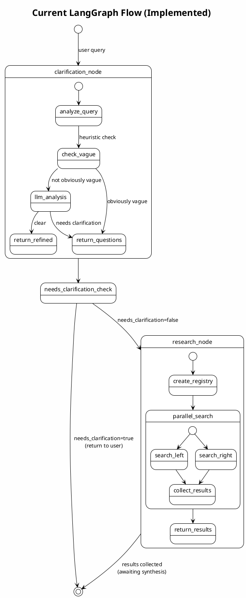
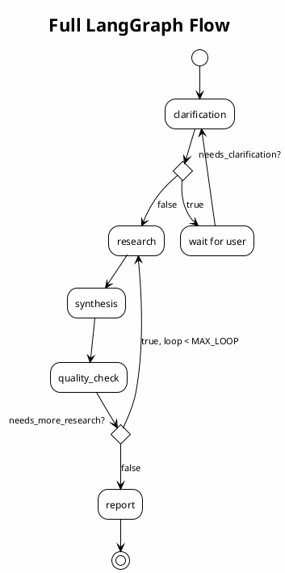

# Agents Module

LangGraph-based agent workflow for balanced political research.

## Current Implementation Status

| Node                 | Status         | Description                                               |
| -------------------- | -------------- | --------------------------------------------------------- |
| `clarification_node` | ✅ Implemented | Analyzes query clarity, generates clarification questions |
| `research_node`      | ✅ Implemented | Parallel search across left/right data sources            |
| `synthesis_node`     | ⏳ TODO        | Synthesize results into balanced report                   |
| `quality_check_node` | ⏳ TODO        | Verify citation coverage, trigger re-research if needed   |

## Graph Flow

### Current Flow (Implemented)

### Full Planned Flow

